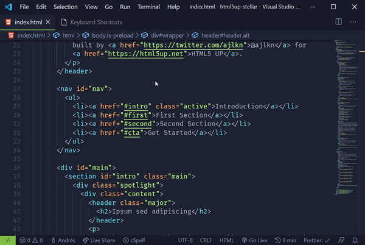
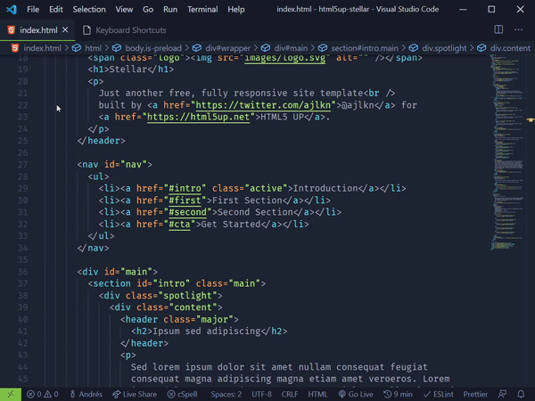

# Features

## Balance (Outward/Inward)

Balance (Outward / Inward):

Outward: <kbd>Ctrl</kbd> + <kbd>Shift</kbd> + <kbd>1</kbd>

Inward: <kbd>Ctrl</kbd> + <kbd>Shift</kbd> + <kbd>2</kbd>

---

## Go to Matching Pair

<kbd>Ctrl</kbd> + <kbd>Shift</kbd> + <kbd>3</kbd>

---

## Remove Tag

<kbd>Ctrl</kbd> + <kbd>Shift</kbd> + <kbd>4</kbd>

---

## Swap Text

<kbd>Ctrl</kbd> + <kbd>Shift</kbd> + <kbd>5</kbd>

NO PHOTO NOW

---

## Create Index

<kbd>MouseRightClick</kbd> on .vue file and click <kbd>Create index</kbd>

NO PHOTO NOW

---

# Extension Settings

don't have settings right now.

# Release Notes

### 0.0.1

Initial release

---
